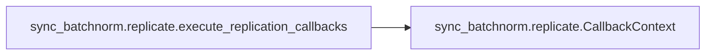
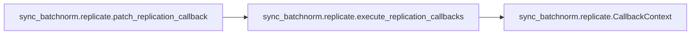

# Sync Batchnorm Replicate

[_Documentation generated by Documatic_](https://www.documatic.com)

<!---Documatic-section-Codebase Structure-start--->
## Codebase Structure

<!---Documatic-block-system_architecture-start--->
```mermaid
None
```
<!---Documatic-block-system_architecture-end--->

# #
<!---Documatic-section-Codebase Structure-end--->

<!---Documatic-section-sync_batchnorm.replicate.execute_replication_callbacks-start--->
## sync_batchnorm.replicate.execute_replication_callbacks

<!---Documatic-section-execute_replication_callbacks-start--->


### Object Calls

* sync_batchnorm.replicate.CallbackContext

<!---Documatic-block-sync_batchnorm.replicate.execute_replication_callbacks-start--->
<details>
	<summary><code>sync_batchnorm.replicate.execute_replication_callbacks</code> code snippet</summary>

```python
def execute_replication_callbacks(modules):
    master_copy = modules[0]
    nr_modules = len(list(master_copy.modules()))
    ctxs = [CallbackContext() for _ in range(nr_modules)]
    for (i, module) in enumerate(modules):
        for (j, m) in enumerate(module.modules()):
            if hasattr(m, '__data_parallel_replicate__'):
                m.__data_parallel_replicate__(ctxs[j], i)
```
</details>
<!---Documatic-block-sync_batchnorm.replicate.execute_replication_callbacks-end--->
<!---Documatic-section-execute_replication_callbacks-end--->

# #
<!---Documatic-section-sync_batchnorm.replicate.execute_replication_callbacks-end--->

<!---Documatic-section-sync_batchnorm.replicate.patch_replication_callback-start--->
## sync_batchnorm.replicate.patch_replication_callback

<!---Documatic-section-patch_replication_callback-start--->


### Object Calls

* sync_batchnorm.replicate.execute_replication_callbacks

<!---Documatic-block-sync_batchnorm.replicate.patch_replication_callback-start--->
<details>
	<summary><code>sync_batchnorm.replicate.patch_replication_callback</code> code snippet</summary>

```python
def patch_replication_callback(data_parallel):
    assert isinstance(data_parallel, DataParallel)
    old_replicate = data_parallel.replicate

    @functools.wraps(old_replicate)
    def new_replicate(module, device_ids):
        modules = old_replicate(module, device_ids)
        execute_replication_callbacks(modules)
        return modules
    data_parallel.replicate = new_replicate
```
</details>
<!---Documatic-block-sync_batchnorm.replicate.patch_replication_callback-end--->
<!---Documatic-section-patch_replication_callback-end--->

# #
<!---Documatic-section-sync_batchnorm.replicate.patch_replication_callback-end--->

[_Documentation generated by Documatic_](https://www.documatic.com)